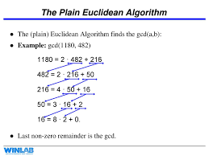

# Multiples And Divisors(Zatona)

- GCD
- LCM
- Euclidean Algorithm
  
  ___

**GCD (Great Common Divisor)**

  The greatest common divisor is refers to the greatest positive integer that is a common divisor for a given set of positive integers.Also known as ***Greatest Common Factor***
  ex 
  - gcd ( 40 , 24 ) = 8 
  - gcd ( 15 , 35 ) = 5 
  - gcd ( 6 , 12 ) = 6

**how to calculate GCD?**

there is built in function in c++ used to calculat gcd by typing 
>```c++
> __gcd(a,b); 
>              //a: is the first number 
>             //b: is the second
>```

___
**LCM(Least common multiple)**

It is the smallest positive common multiple of a group of integers.Also known as ***Lowest Common Multiple***

ex 
  - lcm ( 2 , 3 ) = 6
  - lcm ( 5 , 3 ) = 15
  - lcm ( 9 , 24 ) = 72

**how to calculate LCM?**
By applining this formula

> LCM (a,b) = a * b / gcd( a , b ); 

___

**Euclidean Algorithm**

    The GCD of two different natural numbers is the same as the GCD of the smaller of the two natural numbers and their difference.This is helpful because it is almost always simpler to find the divisors of smaller integers.

> For natural numbers m and n, where m > n,
>
> gcd( m , n ) = gcd( m - n , n ).  

ex



The code is :

```c++
  int gcd(int a,int b) {
  int R;
  while ((a % b) > 0)  {
    R = a % b;
    a = b;
    b = R;
  }
  return b;
}
/*
  a : is the greater num
  b : the smaller
  R : the remainder
*/
```